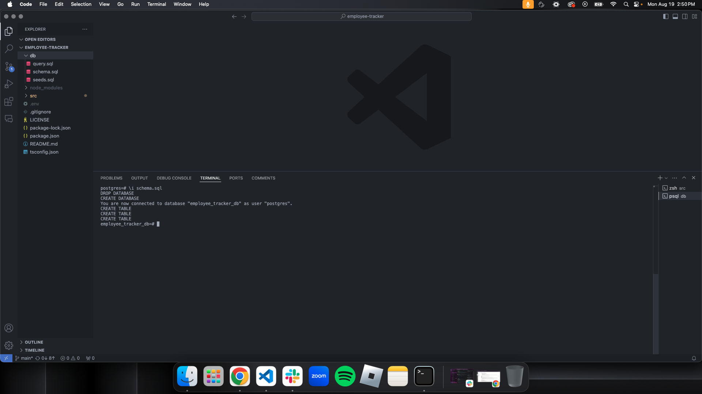
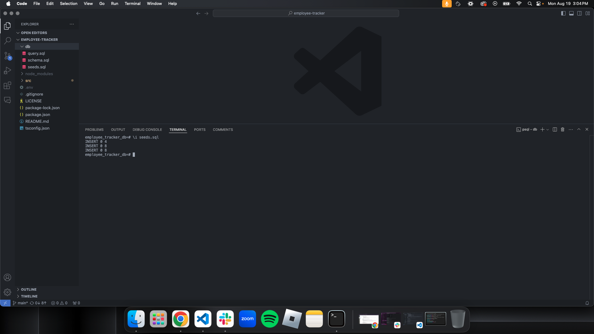
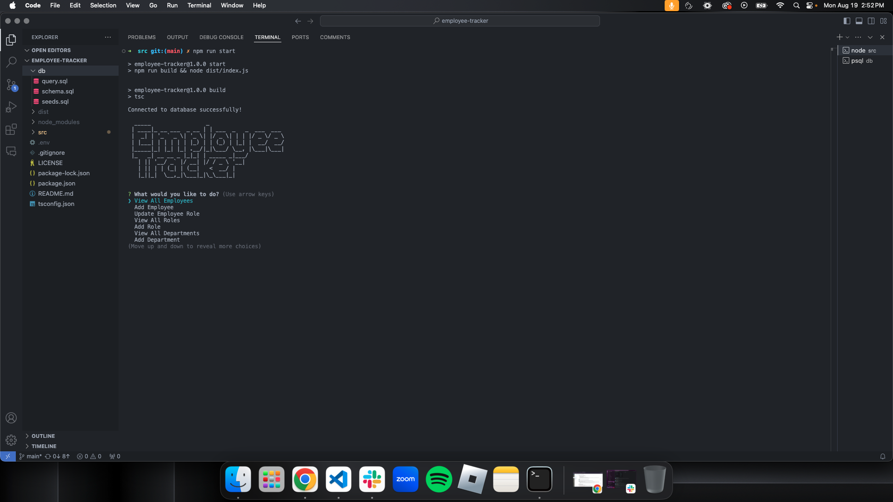

# Employee Tracker

## Description
This application is an Employee Tracker, designed to manage and organize employee information within a company. It provides a command-line interface (CLI) for users to interact with a database, allowing them to perform various operations related to employees, departments, and roles.

## Table of Contents
- [Installation](#installation)
- [Usage](#usage)
- [License](#license)
- [Contributing](#contributing)
- [Tests](#tests)
- [Questions](#questions)

## Installation
In order to use this application, you must install node.js as well as postgresql in order to have the code work as promised.

## Usage
In order to run and use this application, you must right click the db folder and run the scheme.sql and seeds.sql using the commands \i schema.sql etc. in order to access the postgres CLI you must type in psql -U postgres and enter your pass word. Optionally, you can choose to have a blank slate. Right click the src folder and open intergrated terminal, and run the command, "npm run start" this will run the application and you can add departments, roles, and employees, even managers to start your companys database.

## License
This project is licensed under the [MIT](https://opensource.org/licenses/MIT) license.

## Contributing
Contributions are welcome! If you have suggestions for improvements or new features, please create an issue or submit a pull request. For major changes, please open an issue first to discuss what you would like to change. Thank you!

## Tests
The test instructions are a npm run build which will transpile your code into javascript formatting, and also a npm run start that will build and run your application, (It is reccommended to run a npm run start for easy access to the appllication.)

## Questions
If you have any questions, you can reach me at [berczikbryce@gmail.com](mailto:berczikbryce@gmail.com). You can also find more of my work at [bryceberczik](https://github.com/bryceberczik) on Github.
